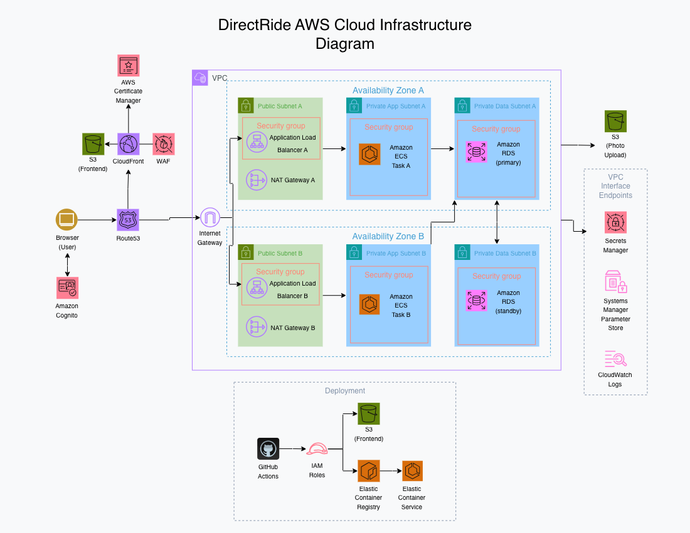

# Direct Ride Terraform

## Project Overview

DirectRide Infrastructure contains the Infrastructure as Code (IaC) for the DirectRide platform. This repository provisions the AWS infrastructure required to host the frontend, backend API, networking, database, security resources, and CI/CD integrations.

The infrastructure is written in Terraform using reusable modules to promote consistency, maintainability, and scalability across environments.

This repository demonstrates cloud engineering best practices including Infrastructure as Code, least-privilege IAM, secure secret management, modular Terraform architecture, and production-inspired AWS networking.

## Architecture Diagram



## Tech Stack

| Category       | Technology                            |
| -------------- | ------------------------------------- |
| IaC            | Terraform                             |
| Cloud Provider | AWS                                   |
| Containers     | Amazon ECS Fargate                    |
| Networking     | VPC, ALB, NAT Gateway                 |
| Database       | Amazon RDS PostgreSQL                 |
| Storage        | Amazon S3                             |
| Security       | IAM, Secrets Manager, Parameter Store |
| Registry       | Amazon ECR                            |
| Monitoring     | CloudWatch                            |
| CI/CD          | GitHub Actions + OIDC                 |

## Why This Tech Stack

| Technology      | Why I Chose It                                                                    |
| --------------- | --------------------------------------------------------------------------------- |
| Terraform       | Declarative Infrastructure as Code with reusable modules and state management.    |
| AWS             | Broad managed service ecosystem for scalable, production-inspired cloud infrastructure. |
| ECS Fargate     | Container orchestration without managing EC2 instances.                           |
| VPC             | Isolated networking foundation with controlled public, private app, and database subnets. |
| ALB             | Managed layer 7 load balancing for routing external API traffic to ECS services.  |
| NAT Gateway     | Enables private application workloads to reach the internet without public exposure. |
| RDS PostgreSQL  | Managed relational database with automated backups and high availability options. |
| IAM             | Fine-grained access control for least-privilege service and deployment permissions. |
| Secrets Manager | Secure storage and rotation of sensitive application secrets.                     |
| Parameter Store | Centralized storage for non-sensitive application configuration.                  |
| ECR             | Managed container registry integrated with ECS deployments.                       |
| CloudWatch      | Centralized logging and monitoring for infrastructure and application workloads.  |
| GitHub OIDC     | Eliminates long-lived AWS access keys by using short-lived identity federation.   |
| S3              | Durable, low-cost static website hosting.                                         |

## Engineering Decisions

### Modular Terraform Design

Infrastructure is organized into reusable modules so networking, compute, security, and storage can evolve independently and be reused across environments.

### Multi-AZ Networking

The VPC spans two Availability Zones to improve availability while maintaining isolated public, application, and database subnets.

### Least-Privilege IAM

IAM roles grant only the permissions required by ECS tasks and deployment pipelines, following AWS security best practices.

### Secrets Management

Application secrets are stored in AWS Secrets Manager while non-sensitive configuration lives in Systems Manager Parameter Store.

### GitHub OIDC Authentication

CI/CD pipelines authenticate to AWS using OpenID Connect instead of long-lived IAM access keys.

### Containerized Compute

The backend is deployed on ECS Fargate, eliminating the need to manage EC2 instances while allowing the application to scale independently.

### Infrastructure as Code

Every cloud resource required for DirectRide can be recreated consistently through version-controlled Terraform code.

## Features

### Networking

- VPC
- Public/private/database subnets
- Internet Gateway
- NAT Gateway
- Route tables

### Compute

- ECS Cluster
- Fargate Service
- Application Load Balancer
- CloudWatch Logs

### Data

- PostgreSQL RDS
- Secrets Manager
- Systems Manager Parameter Store

### Storage

- Static website S3 bucket
- Container images in ECR

### Security

- IAM roles
- Security Groups
- OIDC authentication
- Encrypted resources

### Automation

- GitHub Actions deployment roles
- Terraform modules
- AWS Budgets

## Project Structure

```text
.
+-- environments/
|   +-- dev/                 # Dev environment composition
+-- modules/
|   +-- budget/              # AWS monthly cost budget and email notifications
|   +-- compute/             # ECS Fargate, ALB, target group, logs, service SGs
|   +-- database/            # RDS PostgreSQL and database security group
|   +-- ecr/                 # Backend API image repository and lifecycle policy
|   +-- github-oidc-deploy-role/ # GitHub Actions OIDC deploy role for frontend releases
|   +-- monitoring/          # Monitoring module placeholder
|   +-- networking/          # VPC, subnets, routes, IGW, NAT, DB subnet group
|   +-- security/            # IAM, GitHub OIDC, Secrets Manager, SSM parameters
|   +-- storage/             # Frontend S3 website bucket
+-- docs/
    +-- architecture-notes.md
    +-- cloud-infrastructure-diagram.png
```

## Roadmap

Upcoming features planned for future versions of DirectRide's Cloud Infrastructure include:

Future roadmap items have not been defined yet.
